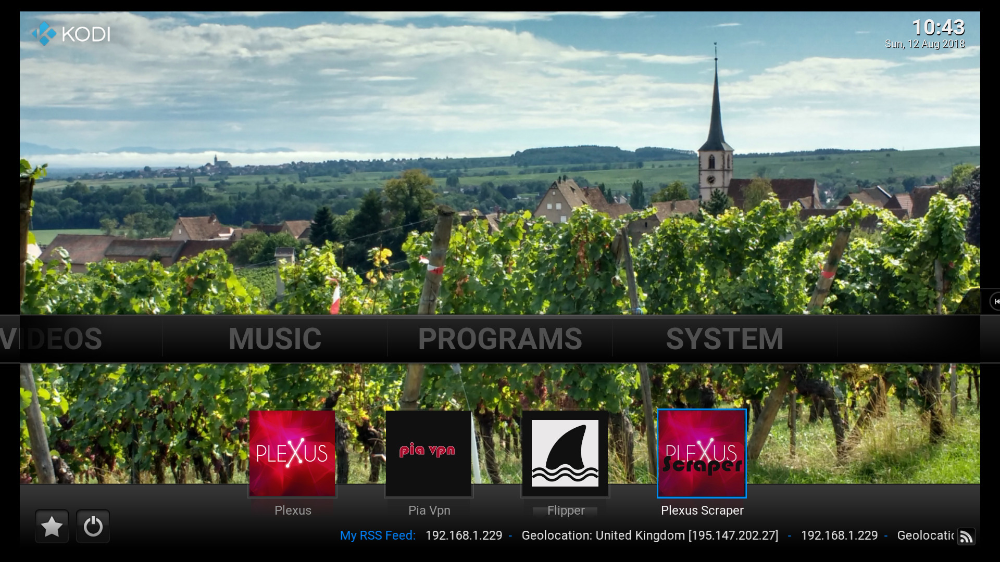
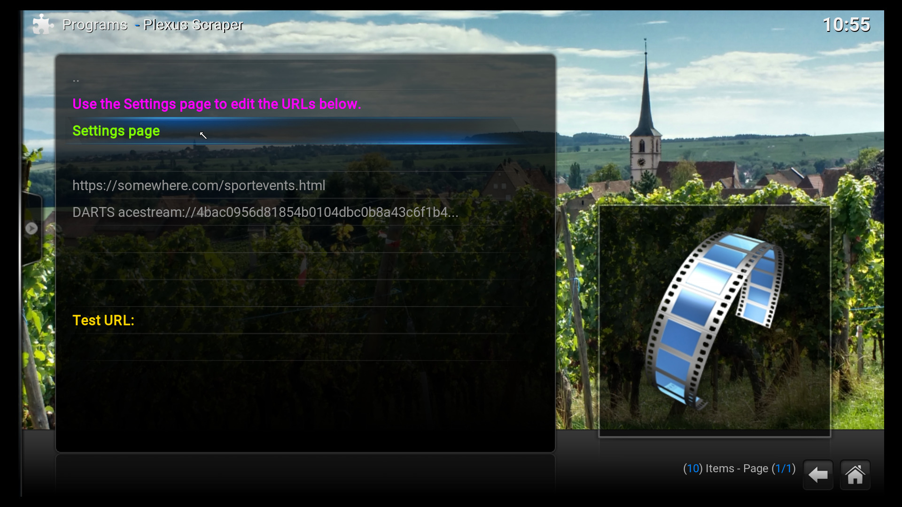
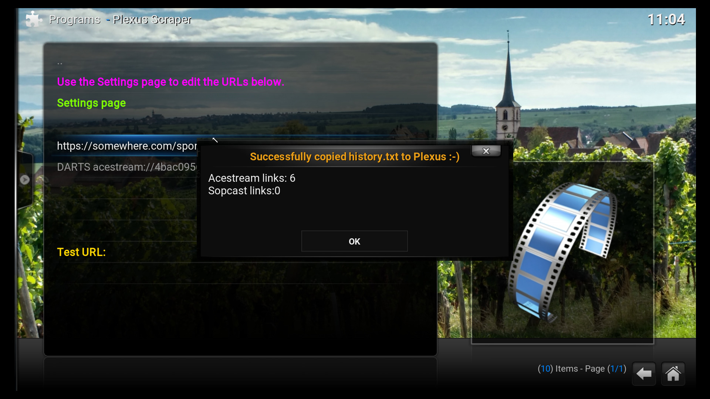
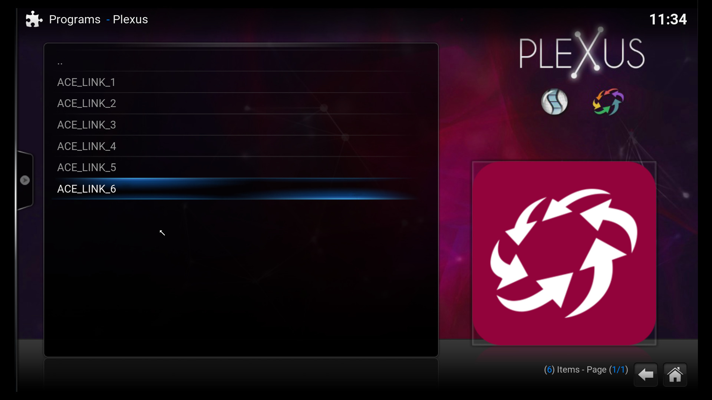

# plugin.program.plexusscraper

This is a Kodi Program addon to scrape acestream (and sopcast)  urls from a web page. Currently up to 5 different web page urls to be scraped can be saved in the addon settings page.  

It is also possible to save a raw acestream link (instead of a web page url) in the settings page. This raw acestream link can   
also be given a name. This link will also appear in the created Plexus "history.txt" file.

The purpose of this addon is to generate a valid "history.txt" file to be used by the Plexus addon. This addon effectively   
automates the generation of a Plexus "history.txt" file.

  
  
  
  
